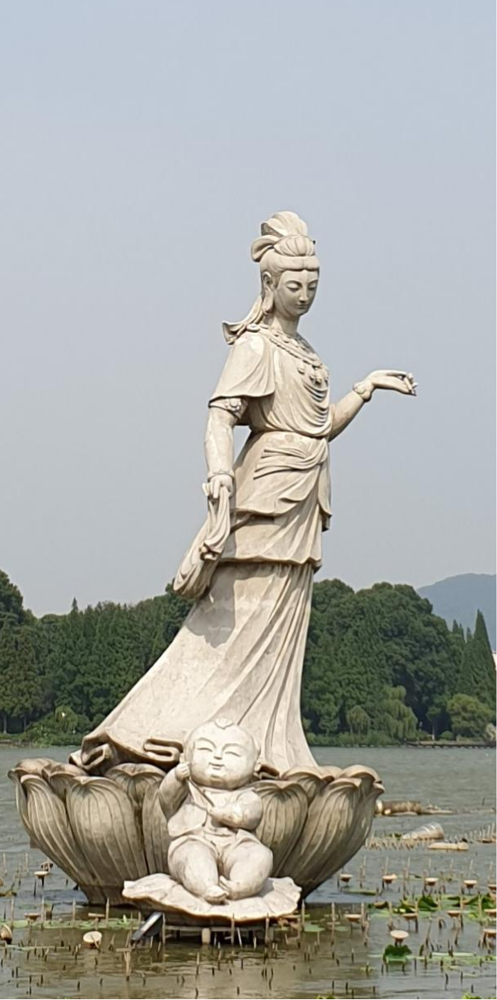

# 自我介绍

我叫张雪琪，我的家庭成员有

* 老公
* 5岁女儿
  
我的爱好是

1. 游泳
2. 弹钢琴
3. 观看方老师课程，学习前端体系知识



10年前学过`C语言`,工作没有用到，现在已经全忘了，所以在这里检验学过的知识，拷贝参考答案里的代码试试

```javascript
function f(){
  console.log('hello world')
}

f()
```